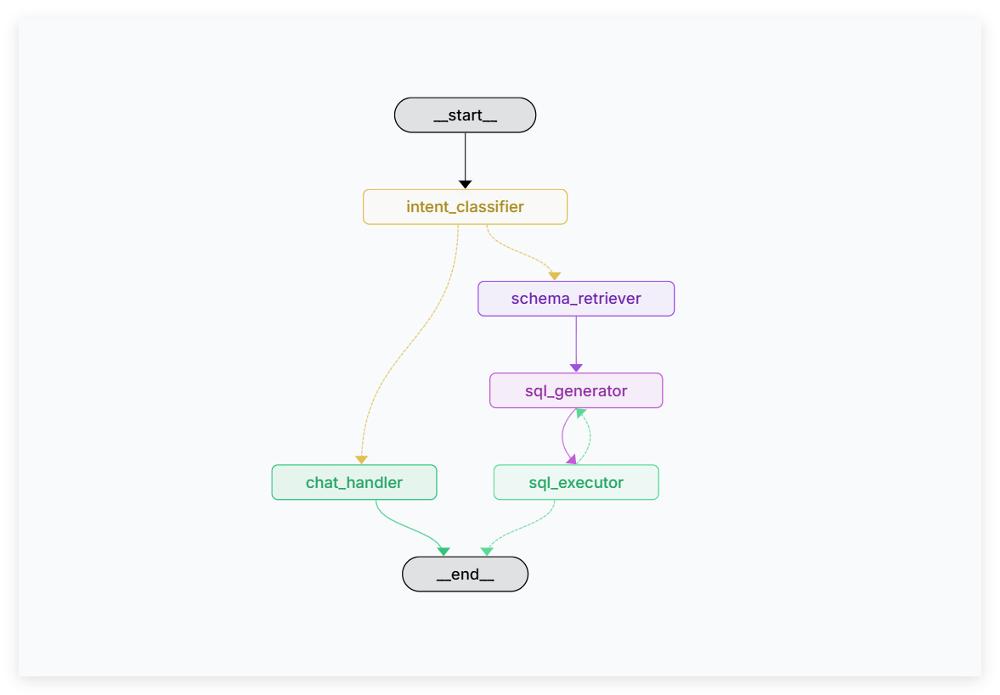
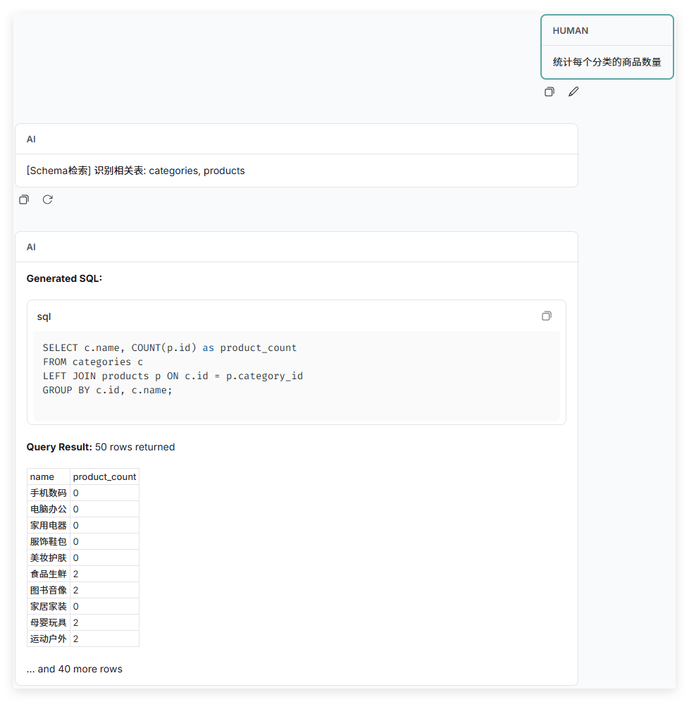
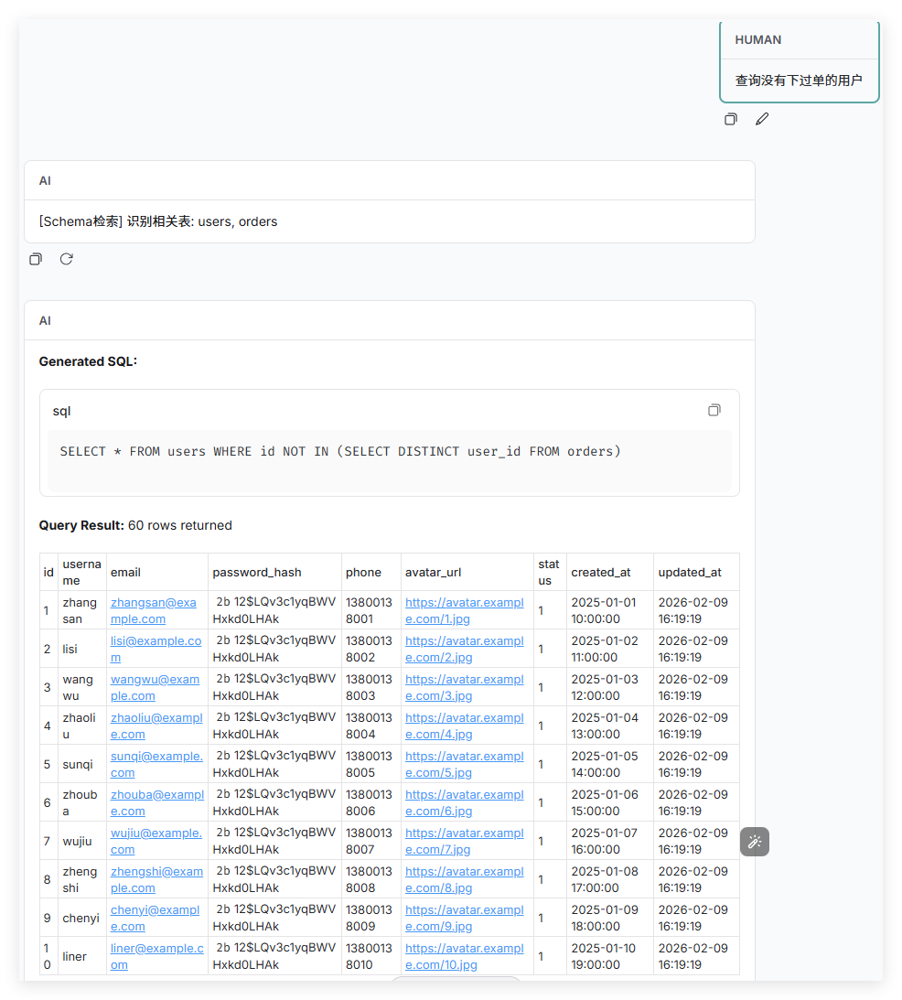
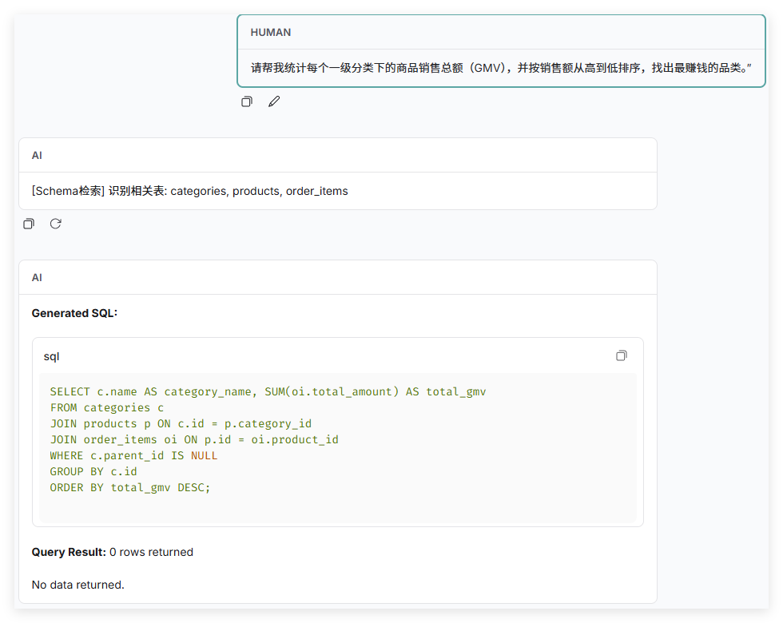
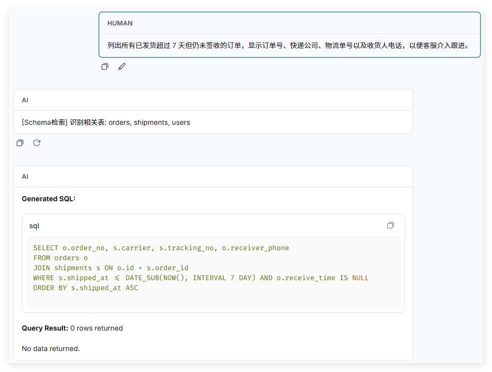
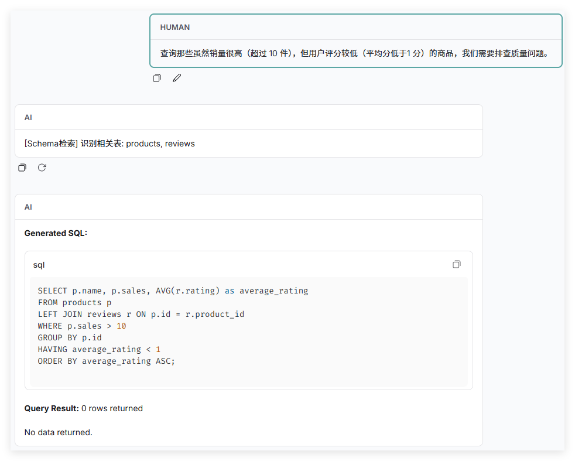

# 🤖 SQL-Agent — 基于 LangGraph 的智能 SQL 多 Agent 协作系统

<p align="center">
  <strong>自然语言 → SQL 查询 → 自动执行 → 结果解读，一站式完成</strong>
</p>

<p align="center">
  
  
  
  
  
</p>

---

## ✨ 项目亮点

- 🧠 **多 Agent 协作架构** — 采用 Supervisor-Worker 模式，多个专业 Agent 分工协作，各司其职
- 🎯 **智能意图识别** — 自动区分自然语言闲聊与 SQL 查询需求，精准路由
- 🔍 **RAG 增强生成** — 基于 FAISS 向量检索，利用历史 SQL 示例指导生成，提升准确率
- 🛡️ **安全沙箱执行** — SQL 在隔离的 Docker MySQL 容器中执行，保障数据安全
- 🔄 **自动纠错重试** — SQL 执行失败时自动分析错误原因并重新生成，最多重试 5 次
- 🚀 **灵活模型部署** — 支持云端 API（OpenAI / Google / 第三方）和本地 vLLM 部署两种方式
- 📊 **LangGraph Studio** — 可通过 `langgraph dev` 可视化调试 Agent 工作流
- 🔗 **LangSmith 追踪** — 内置 LangSmith 链路追踪，方便调试与性能分析

---

## 🏗️ Agent 架构

```
                        ┌──────────────────────────┐
                        │       用户输入 (Query)      │
                        └─────────────┬────────────┘
                                      ▼
                        ┌──────────────────────────┐
                        │    🎯 Intent Classifier    │
                        │      (意图识别 Agent)       │
                        └──────┬──────────────┬────┘
                               │              │
                          chat │              │ sql / text_to_sql / debug
                               ▼              ▼
                  ┌─────────────────┐  ┌──────────────────┐
                  │  💬 Chat Handler │  │ 🔍 Schema Retriever│
                  │   (闲聊处理器)    │  │  (Schema 检索器)   │
                  └────────┬────────┘  └────────┬─────────┘
                           │                    │
                           ▼                    ▼
                        结束输出          ┌──────────────────┐
                                        │ ⚡ SQL Generator   │◄──── RAG 向量检索
                                        │  (SQL 生成器)      │     (FAISS + 历史示例)
                                        └────────┬─────────┘
                                                 │
                                                 ▼
                                        ┌──────────────────┐
                                        │ 🛡️ SQL Executor   │
                                        │ (安全沙箱执行器)    │
                                        └───┬──────────┬───┘
                                            │          │
                                       成功  │          │ 失败 (retry < max)
                                            ▼          ▼
                                        结果输出    回到 SQL Generator
```

### LangGraph 编排图

下图为项目部署成功后，在 LangSmith 中生成的实际 Agent 编排图。清晰展示了 Intent Classifier 到各个 Worker 的路由逻辑，以及 RAG 和 Feedback loop 的工作流：

<div align="center">
  
</div>

---

## 📁 目录结构

```
SQL-Agent/
├── .env.example
├── README.md
├── data/
│   └── sql_examples/
├── docker/
│   ├── Dockerfile
│   ├── Dockerfile.mysql
│   ├── docker-compose.yml
│   ├── init/
│   └── my.cnf
├── figs/
├── langgraph.json
├── main.py
├── pyproject.toml
├── qwen_raw/
│   ├── .env.example
│   ├── langgraph.json
│   ├── pyproject.toml
│   └── src/
│       ├── graph.py
│       ├── schema.py
│       └── state.py
├── scripts/
│   ├── init_rag.py
│   └── start_vllm.sh
└── src/
    ├── __init__.py
    ├── agents/
    │   ├── base.py
    │   ├── state.py
    │   ├── supervisor/
    │   └── workers/
    ├── config/
    │   ├── llm.py
    │   └── settings.py
    ├── graph/
    │   └── workflow.py
    └── rag/
        ├── data_loader.py
        ├── embeddings.py
        ├── feedback_loop.py
        ├── sql_generator_auto.py
        ├── sql_retriever.py
        └── vector_store.py
```

---

## 🚀 快速开始

### 1️⃣ 克隆项目

```bash
git clone https://github.com/TaoJiang999/SQL-Agent.git
cd SQL-Agent
```

---

### 2️⃣ 环境准备

#### 2.1 安装 Docker

本项目需要 Docker 来运行 MySQL 沙箱容器。

- **Windows**: 下载安装 [Docker Desktop](https://www.docker.com/products/docker-desktop/)
- **macOS**: `brew install --cask docker`
- **Linux (Ubuntu)**:
  ```bash
  sudo apt-get update
  sudo apt-get install docker.io docker-compose
  sudo systemctl start docker
  sudo systemctl enable docker
  ```

安装完成后验证：
```bash
docker --version
docker-compose --version
```

#### 2.2 构建 Python 环境 (可选，仅用于本地开发)

如果希望在本地直接运行非 Docker 环境，可以使用 [uv](https://docs.astral.sh/uv/) 作为 Python 包管理器：

```bash
# 安装 uv
pip install uv

# 创建虚拟环境并安装依赖
uv venv --python 3.11
# Windows
.venv\Scripts\activate
# Linux / macOS
source .venv/bin/activate

# 安装项目依赖
uv pip install -e .

# (可选) 安装开发依赖
uv pip install -e ".[dev]"
```

#### 2.3 启动服务 (MySQL + Agent)

本项目使用 Docker Compose 编排 MySQL 沙箱和 Agent 服务。Agent 容器基于 `vllm/vllm-openai` 官方镜像构建，**会自动拉取该镜像（约几 GB）**，请确保网络畅通。

> **注意**: 
> 1. 如果使用 vLLM 本地部署，请确保宿主机已安装 [NVIDIA Container Toolkit](https://docs.nvidia.com/datacenter/cloud-native/container-toolkit/install-guide.html) 以支持 GPU 透传。
> 2. `agent` 服务启动后默认为开发环境，代码挂载在 `/app`。

启动 Docker 环境：

```bash
cd docker
# 构建并启动所有服务 (后台运行)
# 这将自动拉取 vLLM 镜像并构建 Agent 环境
docker-compose up -d --build
cd ..
```

验证服务运行状态：
```bash
docker ps
# 应看到 sql-agent-sandbox (MySQL) 和 sql-agent-main (Agent) 容器正在运行

# 测试数据库连接
docker exec -it sql-agent-sandbox mysql -usandbox_user -psandbox_password -e "SHOW DATABASES;"
```

#### 2.4 构建 RAG 索引

初始化 FAISS 向量索引，加载 SQL 示例数据用于 RAG 检索增强：

```bash
python scripts/init_rag.py init
```

验证索引状态：
```bash
python scripts/init_rag.py status
```

---

### 3️⃣ 配置环境变量

```bash
# 复制环境变量模板
cp .env.example .env
```

编辑 `.env` 文件，根据你的模型部署方式选择配置：

#### 方式 A：使用云端 API 提供商

适用于使用 OpenAI、Google Gemini 或其他兼容 OpenAI 格式的 API 服务：

```env
# LangChain 追踪 (可选，用于调试)
LANGCHAIN_API_KEY=your_langchain_api_key
LANGCHAIN_TRACING_V2=true

# 模型配置 —— 选择你的 API 提供商
MODEL_NAME=gpt-4o                  # 或 gemini-2.5-flash 等
MODEL_PROVIDER=openai              # 或 google_genai
MODEL_BASE_URL=https://api.openai.com/v1   # API 地址
MODEL_API_KEY=sk-your_api_key      # 你的 API Key
```

常见 API 提供商配置示例：

| 提供商 | MODEL_NAME | MODEL_PROVIDER | MODEL_BASE_URL |
|--------|-----------|----------------|----------------|
| OpenAI | `gpt-4o` | `openai` | `https://api.openai.com/v1` |
| Google | `gemini-2.5-flash` | `google_genai` | `https://generativelanguage.googleapis.com` |
| 第三方代理 | `gpt-4o` | `openai` | `https://your-proxy.com/v1` |

#### 方式 B：使用 vLLM 本地部署

适用于有 GPU 服务器，希望本地部署开源模型（如 Qwen2.5）的场景：

**① 启动 vLLM 服务：**

```bash
# 修改脚本中的 MODEL_PATH 为你的模型路径
# 可根据需要调整 GPU 数量、量化方式等参数
bash scripts/start_vllm.sh
```

主要可配置参数：

| 参数 | 默认值 | 说明 |
|------|--------|------|
| `MODEL_PATH` | (需修改) | HuggingFace 模型本地路径 |
| `CUDA_DEVICES` | `0,1` | 使用的 GPU 编号 |
| `QUANTIZATION` | `gptq_marlin` | 量化方式 |
| `TENSOR_PARALLEL_SIZE` | `2` | 张量并行数 (= GPU 数量) |
| `MAX_MODEL_LEN` | `32768` | 最大上下文长度 |

**② 配置 `.env` 文件：**

```env
MODEL_NAME=qwen-agent               # vLLM served-model-name
MODEL_PROVIDER=openai                # vLLM 兼容 OpenAI 格式
MODEL_BASE_URL=http://localhost:8000/v1
MODEL_API_KEY=not-needed             # 本地部署无需 API Key
```

---

### 4️⃣ 启动项目

#### 方式一：使用 LangGraph Dev Server（推荐）

```bash
langgraph dev --allow-blocking
```

该命令会启动后端 API 服务。要使用可视化界面，有两种方式：

1. **自动跳转 (LangSmith)**:
   启动命令后，浏览器会自动打开 LangSmith 控制台页面，连接本地服务进行调试。

2. **本地部署 Chat UI**:
   如果你想使用开源的 Chat UI 前端：

   ```bash
   # 克隆前端项目
   git clone https://github.com/langchain-ai/agent-chat-ui.git
   cd agent-chat-ui
   
   # 安装依赖并启动（需要 Node.js）
   pnpm install
   pnpm dev
   ```
   
   启动后访问前端页面（通常是 `http://localhost:3000`），并在配置中指向你的 LangGraph 后端地址。

---


## 🧪 启动原生 Qwen 基线 (可选)

为了直观对比 Agent 的增强效果，本项目还提供了一个原生的 Qwen 模型 Agent（不包含 Schema 检索和 RAG 增强）。

首先进入 `qwen_raw` 目录，然后使用 `langgraph` 启动：

```bash
cd qwen_raw
cp .env.example .env
langgraph dev
```

---

## 📊 效果展示与对比

### ✅ SQL-Agent (增强版) 效果

以下实测截图展示了 SQL-Agent 在实际场景中的表现。通过集成 **动态 Schema 检索** 和 **RAG (检索增强生成)**，Agent 显著提高了 SQL 生成的准确性。








### ❌ 原生 Qwen 的不足

相比之下，直接使用原生模型 (qwen_raw) 往往存在以下问题：

1.  **缺乏 Schema 感知**：虽然提供了完整的数据库 Schema 作为上下文，但原生模型缺乏对结构信息的深度感知和理解能力。在面对复杂查询时，难以准确定位所需表结构，容易产生幻觉（如编造表名或字段）或构建错误的表关联。
2.  **无 RAG 支持**：对于特定领域的查询逻辑（如特定的计算公式或业务规则），原生模型无法参考历史经验，导致生成逻辑错误。
3.  **无闭环反馈**：当 SQL 执行出错时，原生模型无法获取报错信息进行自我修正。

---

## 📄 License

MIT
